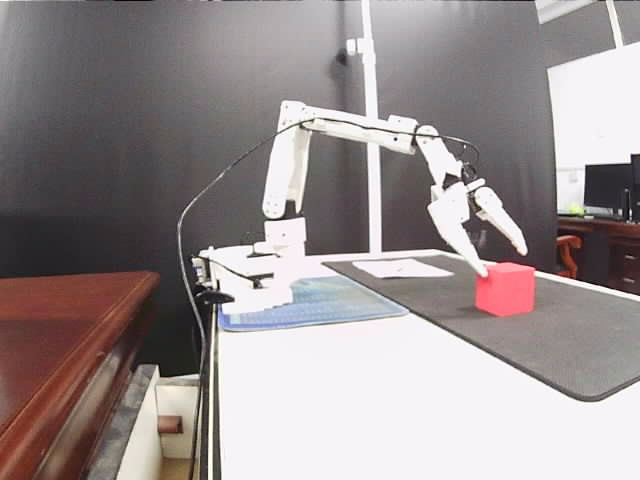
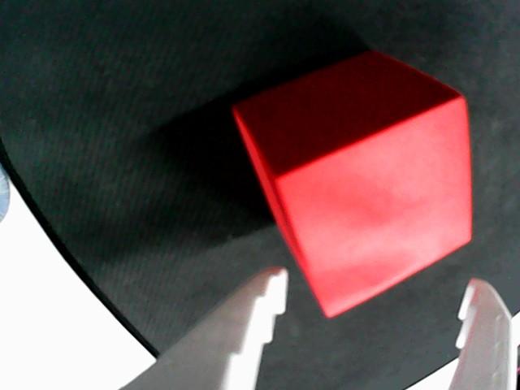
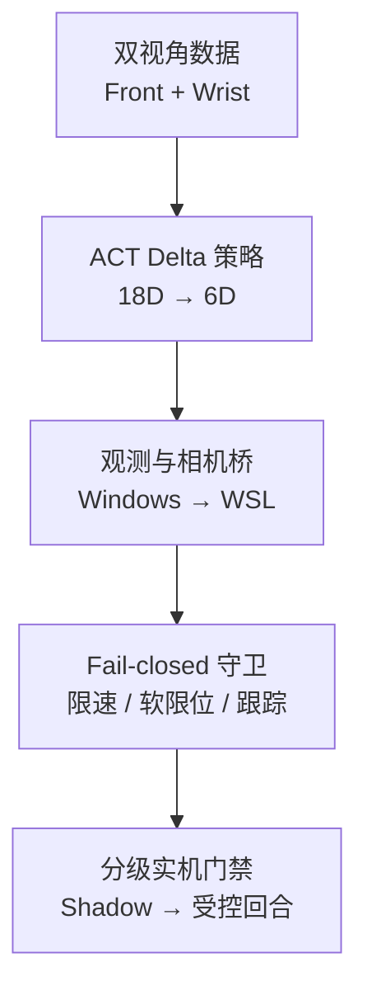

# SO-ARM101 双视角 ACT 模仿学习与安全部署

> **Stage 1: CLOSED / FROZEN**
> 工程链路完成，策略任务未达标；项目依据预先定义并冻结的停止条件冻结。

这是一个真实 SO-ARM101 机械臂项目：从 Front/Wrist 双视角数据、ACT 训练、Windows→WSL 图像桥、只读关节状态，到 fail-closed 安全守卫和分级实机执行。系统完成了一个 900/900 命令的受控策略回合并安全清理硬件，但红色方块抓取失败；专项评测进一步定位到夹爪输出塌缩，因此没有继续部署。

本仓库展示的是一条**可审计的机器人学习工程链路和一次有证据的负结果**，不是“自主抓放已经成功”的演示。

## 最终状态

| 维度 | 结果 | 证据摘要 |
|---|---|---|
| 数据与训练 | 完成 | 48 个训练回合、12 个验证回合，共 53,382 帧 |
| 双视角推理链路 | 完成 | Front/Wrist 采集、桥接、预处理与 18D 观测装配通过 |
| 分级安全部署 | 完成 | Shadow → Controlled Home → 5 命令 → 1 个受控回合 |
| 单回合工程执行 | 通过 | 180 replans、900/900 命令确认、0 rate clip、0 tracking trip |
| 抓取任务 | **失败** | 回合结束时方块未被夹取，夹爪命令仅在 27.648575–27.837341 之间变化 |
| 后续部署 | **冻结** | V3/V4 均无 checkpoint 同时通过夹爪转移方向与幅度门槛 |

## 结果帧

| Front | Wrist |
|---|---|
|  |  |

图像在策略回合结束、确定性返回 Home 之前采集。它们证明了真实相机链路和机械臂执行已经运行，也清楚显示任务没有完成。

## 系统链路



### 数据与策略合同

| 项目 | 配置 |
|---|---|
| 机械臂 | SO-ARM101-compatible follower，6 个电机 |
| 数据 | 42,678 训练帧 + 10,704 验证帧，15 FPS |
| 图像 | `observation.images.front`、`observation.images.wrist`，各 3×480×480 |
| 状态 | 18D：位置、速度和位置增量 |
| 动作 | 6D 关节 delta action |
| 策略 | ACT + ResNet18，chunk=10，n_action_steps=5 |
| 运行环境 | Windows 相机采集 + WSL2 推理与控制 |

### 关键工程指标

| 项目 | 结果 |
|---|---:|
| 60 秒双相机审计 | Front 19.944 FPS；Wrist 15.050 FPS |
| 双相机时间偏差 | p95 22.875 ms |
| Live Shadow | 180/180 replans @ 3 Hz；未发送动作 |
| Shadow 推理延迟 | p95 74.839 ms |
| Controlled Home | 106 条命令，7.1 秒；commissioning 复核容差内通过 |
| 五命令 commissioning | 5/5 确认，无裁剪、无跟踪跳闸 |
| 单受控策略回合 | 180 replans，900/900 命令，75.369 秒 |
| 回合安全结果 | 0 rate clip、0 新边界越界、0 tracking trip、不变量误差 0 |
| 退出清理 | 返回 Home；扭矩、串口和双相机工作进程关闭 |

## 为什么冻结，而不是继续试

Stage 3C 的运动管线通过，但抓取失败。900 条已确认命令中的夹爪目标几乎保持常数，说明问题不在“命令没发出去”，而在策略没有学到足够的开合转移。

- V3 从 16K 延长到 40K，7 个 checkpoint 的 close/open transition recall 仍全部为 0。
- V4 使用 `WeightedRandomSampler`，把 background/close/open 的采样比例从 88.53%/5.78%/5.69% 调整为 50%/25%/25%。
- V4 的跨检查点最佳单项值是：16K close recall 50.0%，20K open recall 32.4%。它们**来自不同 checkpoint**，且没有任何 checkpoint 同时通过方向与幅度门槛。
- 预先定义并冻结的停止条件因此触发：不再训练 V3/V4，不再做硬件复测。

完整分析见 [项目收尾文档](docs/PROJECT_CLOSEOUT.md)，逐 checkpoint 指标见 [V4 指标 CSV](evidence/release/v4_checkpoint_metrics.csv)。

## 安全设计

硬件能力按风险逐级解锁，每一级都要求前一级证据通过并使用独立授权参数：

1. 纯离线守卫与适配器自审。
2. 单次只读关节读取，不 configure、不改扭矩。
3. Live Shadow：相机 + 状态 + ACT 推理，只记录、不下发动作。
4. Controlled Home：限时、限速、全轨迹预审计。
5. 五条策略命令 commissioning。
6. 单个受控策略回合；不允许自动第二回合。

任意非有限值、速率裁剪、新边界越界、未批准软限位保持、持续跟踪误差或传感器故障都会停止后续策略写入。正常与异常退出都尝试关闭扭矩、串口和相机进程。

## 仓库内容

```text
configs/safety/        冻结的运行时安全合同
scripts/dataset/       LeRobot 数据集构建与校验
scripts/eval/          离线审计、相机与部署门禁
scripts/runtime/       观测、守卫、Shadow 与受控执行
scripts/train/         ACT 训练与 V4 转移均衡实验
evidence/release/      可公开的小型证据包
docs/PROJECT_CLOSEOUT.md
```

原始数据、checkpoint、完整 `outputs/`、标定文件与厂商源码不进入公开仓库。公开证据包只保留去路径化的汇总指标、checkpoint CSV 和任务结束帧。

## 环境与只读核验

`environment.yml` 是 WSL 基础环境，不是假装完整的 CUDA lockfile。厂商 LeRobot、Windows 相机桥和已验证版本矩阵见 [依赖说明](docs/DEPENDENCIES.md)。

```bash
conda env create -f environment.yml
conda activate embodiedarm

# 仅做公开仓库静态核验，不访问硬件
python scripts/release/verify_public_closeout.py
```

真实训练/运行还需要本地厂商 LeRobot 源码、标定、数据和 checkpoint；这些资产不会公开。不要在未重新完成硬件安全门禁的情况下运行任何带运动授权的脚本。

## 可复核证据

- [公开证据说明](evidence/release/README.md)
- [Stage 1 汇总 JSON](evidence/release/stage1_summary.json)
- [V3 checkpoint 指标](evidence/release/v3_checkpoint_metrics.csv)
- [V4 checkpoint 指标](evidence/release/v4_checkpoint_metrics.csv)
- [Front 任务结束帧](evidence/release/front_task_outcome.png)
- [Wrist 任务结束帧](evidence/release/wrist_task_outcome.png)
- [完整项目收尾文档](docs/PROJECT_CLOSEOUT.md)

## 项目边界

可以准确陈述：完成真实机械臂数据、训练、双视角推理、安全守卫和受控执行闭环，并在专项门槛未通过时阻止继续部署。

不能陈述：已经稳定完成自主抓取/放置；V4 已解决夹爪问题；Home→Park 平滑折叠已经通过实机验证。
