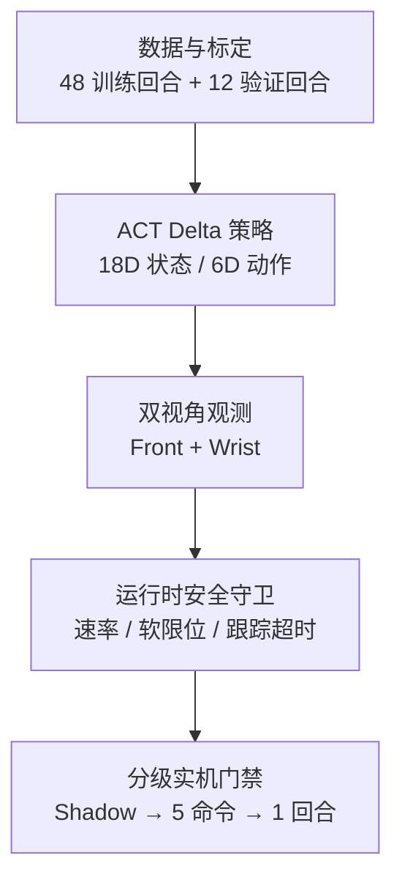

# SO-ARM101 双视角 ACT 模仿学习项目收尾文档

> 最终结论：**工程链路完成，策略任务未达标；项目依据预先定义并冻结的停止条件冻结。** 项目完成了数据、训练、双相机、状态读取、推理、安全守卫和受控实机执行的端到端验证，但夹爪开合转移能力未通过离线门槛，单次受控策略回合也没有完成抓取，因此不宣称自主抓放成功。

## 1. 项目目标与完成定义

项目目标是在 SO-ARM101 六关节机械臂上，使用 LeRobot/ACT 模仿学习执行红色方块抓取与放置，并建立可审计、可回滚、默认拒绝危险动作的部署链路。

本项目的“完结”由预先定义并冻结的规则决定，而不是无限增加训练或硬件尝试：

| 维度 | 完成标准 | 最终状态 |
|---|---|---|
| 工程链路 | 数据、模型、双相机、状态、推理、安全守卫、实机执行可串联 | **通过** |
| 受控执行 | Shadow、少量命令、单回合执行均有证据且安全清理 | **通过** |
| 任务效果 | 抓取/放置成功，夹爪转移专项门槛通过 | **未通过** |
| 安全退出 | 正常/异常路径关闭扭矩、串口与相机进程 | **通过** |
| 停止条件 | 有界训练后仍无 checkpoint 通过专项门槛，则冻结项目 | **已触发** |

## 2. 系统范围

| 模块 | 关键实现 |
|---|---|
| 数据 | 42,678 训练帧、10,704 验证帧、15 FPS；原始归档仅保留在本地，不进入公开仓库 |
| 策略 | ACT、ResNet18、chunk=10、n_action_steps=5、18D 状态、6D delta action、两路 480×480 图像 |
| 相机 | Windows DSHOW 采集，经 TCP/JPEG 桥接到 WSL；按 VID:PID 固定 Front/Wrist 身份 |
| 预处理 | Front 保持 4:3 并上下补黑；Wrist 逆时针旋转 90°并左右补黑；BGR→RGB、NCHW、float32 [0,1] |
| 状态 | 只读 Present_Position；显式禁止 configure、扭矩修改和 Goal_Position 写入 |
| 安全守卫 | 六关节对称速率限制、软限位、边界 outward no-op、持续跟踪误差超时、非有限值 fail-closed |
| 部署门禁 | 离线 → 只读 → Shadow → Controlled Home → 5 命令 → 单受控回合；每级单独授权 |

## 3. 关键工程结果

### 3.1 双相机与观测链路

- Front：VID:PID `32E6:9221`，640×480/MJPG。
- Wrist：VID:PID `32E6:9005`，640×480/YUY2。
- 60 秒双流审计：Front 19.944 FPS，Wrist 15.050 FPS，跨相机时间偏差 p95 22.875 ms。
- Windows→WSL 桥接复测：两路约 15 FPS，0 解码/CRC/序列错误，END/ACK 成功。
- 预处理数值、颜色、旋转、长宽比、补边及三键 ACT 观测合同全部通过。

### 3.2 安全与实机门禁

- 纯守卫算法自审：11/11 通过。
- 离线运行时适配器：2 个回合、50 条命令，0 速率裁剪、0 软限位裁剪、0 跟踪跳闸。
- 实时观测装配器：16/16 fail-closed 用例通过。
- 惰性只读传感器适配器：17/17 通过；单次六关节读取成功且不改变扭矩状态。
- 60 秒 Live Shadow：180/180 replans，3 Hz；关节读取 p95 3.641 ms，推理 p95 74.839 ms；没有发送动作。
- Controlled Home：106 条命令、7.1 秒；elbow_flex 最终误差 3.636° 超过原 2°精度门槛，离线复核在 5° commissioning 容差内接受；退出时关闭扭矩与串口。
- 五命令 commissioning：5/5 策略命令确认，无裁剪、无跳闸；相机 teardown 时长/握手问题经离线证据复核，不是运动错误。
- 单受控策略回合：180 replans、900/900 命令、0 速率裁剪、0 新边界越界、0 跟踪跳闸、守卫不变量误差 0；结束返回 Home，扭矩、串口和相机进程关闭。

公开的去路径化汇总见 [`evidence/release/stage1_summary.json`](../evidence/release/stage1_summary.json)。

## 4. 任务结果与失败诊断

工程执行通过不等于抓取成功。任务结束帧显示夹爪仍在方块附近且没有夹住方块；原始运行报告也明确设置 `stage3c_task_outcome_accepted=false`。

最直接的诊断证据是夹爪输出塌缩：900 条已确认命令中，gripper 指令仅在 27.648575–27.837341 的极窄区间变化，无法复现数据中的打开/闭合转移。

### 4.1 V3：延长训练没有解决问题

V3 从 12K 有界恢复至 40K，审计 16K、20K、24K、28K、32K、36K、40K 七个 checkpoint。所有 checkpoint 的 close/open transition recall 均为 0，表明继续堆训练步数没有改善关键失效。

### 4.2 V4：转移均衡改善召回，但仍未过门槛

V4 不复制原始数据，使用 `WeightedRandomSampler` 将原始采样分布从 88.53% background / 5.78% close / 5.69% open 调整为 50% / 25% / 25%。

| Step | Close recall | Close amplitude | Open recall | Open amplitude | 通过 |
|---:|---:|---:|---:|---:|:---:|
| 4K | 0.000 | 0.030 | 0.000 | 0.073 | 否 |
| 8K | 0.090 | 0.007 | 0.000 | 0.067 | 否 |
| 12K | 0.346 | 0.052 | 0.000 | 0.051 | 否 |
| 16K | **0.500** | **0.239** | 0.015 | 0.055 | 否 |
| 20K | 0.474 | 0.170 | **0.324** | **0.069** | 否 |

这里的 50.0% close recall 与 32.4% open recall 是**跨检查点最佳单项值**：前者来自 16K，后者来自 20K，不能描述成同一模型同时达到。没有任何 checkpoint 同时满足方向和幅度门槛。

最终冻结决策：

`V4_20K_NO_TRANSITION_CHECKPOINT_PASSED_FINAL_PROJECT_STOP`

### 4.3 证据支持的工程推断

以下是工程推断，不是已证明的单一因果结论：

- 原始帧中夹爪 close/open 事件各约占 5.7%，普通平均损失容易学成保持中值。
- ACT 时序块与全关节统一回归可能进一步平滑短时、离散感更强的夹爪动作。
- 转移均衡提高了方向召回，但动作幅度仍不足。
- 若未来建立新阶段，更合理的方向是事件窗口、夹爪专项损失或独立头、标签归一化核验和更多真实转移数据，而不是继续训练冻结的 V3/V4。

## 5. 安全设计复盘

| 风险 | 设计响应 |
|---|---|
| 非法或非有限策略输出 | fail-closed，停止后续命令 |
| 单步动作过大 | 每关节对称 rate clamp；受控回合拒绝任何实际 rate clip |
| 越过软工作区 | 边界投影与 crossing attribution；拒绝新边界越界 |
| Wrist 已处于任务边界 | 向外残差记为边界保持并保持不动；越界仍禁止 |
| 机械臂持续跟不上目标 | 误差持续超过冻结时限后停止；恢复时重置计时器 |
| 上电后姿态未知 | 先只读归因，再预审计完整、有限、单调、限速的 Home 恢复轨迹，最后才允许写目标 |
| 正常退出后掉臂 | 正常路径先返回 Home，再关闭扭矩、串口与相机进程 |
| 异常退出 | 停止策略写入并执行无动作的清理路径 |

“Home→Park 的平滑折叠回程”已经被识别为产品化需求，但在项目冻结前没有形成新的实机验证证据，因此不能写成已完成能力。

## 6. 最终项目状态

### 可以对外陈述

- 完成 SO-ARM101 双视角 ACT 模仿学习端到端原型与分级安全部署链路。
- 完成 60 秒 Shadow、5 命令 commissioning 和 900 命令单回合受控执行，并保持零裁剪、零跟踪跳闸与安全清理。
- 定位夹爪转移塌缩；转移均衡实验的跨检查点最佳单项 close recall 为 50.0%，open recall 为 32.4%。
- 在没有 checkpoint 通过冻结专项门槛时主动阻止继续部署，并按预先定义并冻结的停止条件结束阶段。

### 不可以对外陈述

- “机械臂已经稳定完成自主抓取/放置”。
- “某一个 V4 checkpoint 同时达到 50.0% close recall 和 32.4% open recall”。
- “V4 已经解决夹爪问题”。
- “Home→Park 自动折叠已经通过实机验证”。
- 将 V4 管线退出码 2 描述为技术崩溃；它表示有界实验完成但没有候选通过。

## 7. 公开证据与本地证据边界

公开仓库包含一个小型、去路径化证据包：

| 证据 | 公开路径 |
|---|---|
| Stage 1 汇总指标 | [`evidence/release/stage1_summary.json`](../evidence/release/stage1_summary.json) |
| V3 16K–40K 指标 | [`evidence/release/v3_checkpoint_metrics.csv`](../evidence/release/v3_checkpoint_metrics.csv) |
| V4 4K–20K 指标 | [`evidence/release/v4_checkpoint_metrics.csv`](../evidence/release/v4_checkpoint_metrics.csv) |
| Front 任务结束帧 | [`evidence/release/front_task_outcome.png`](../evidence/release/front_task_outcome.png) |
| Wrist 任务结束帧 | [`evidence/release/wrist_task_outcome.png`](../evidence/release/wrist_task_outcome.png) |

本地仍保留更完整的原始报告、CSV、日志、数据、checkpoint、标定和厂商源码。它们因体积、隐私、设备标识或许可证边界不进入公开仓库。此前文档中的 `outputs/...` 路径是本地证据索引，不是公开可点击资产。

## 8. 阶段封板

- 阶段：Stage 1
- 状态：CLOSED / FROZEN
- 建议 tag：`v0.1.0-stage1`
- 冻结范围：V3/V4 训练、当前策略的硬件复测、自动部署
- 不冻结的内容：文档勘误、公开证据整理、CPU-only CI、面试材料

> 这是一个完成了工程闭环、暴露并量化了模型失效、最终由冻结门槛阻止错误部署的具身智能项目；它不是一个已经完成抓取任务的产品。
