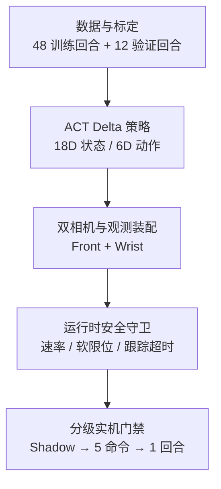

# SO-ARM101 双目 ACT 模仿学习项目收尾文档

> 最终结论：**工程链路完成，策略任务未达标，项目按预注册停止条件收口。** 该项目已经完成从数据、训练、双相机、状态读取、推理、安全守卫到受控实机执行的端到端验证；但夹爪开合转移能力未通过离线门槛，单次受控策略回合也未完成抓取，因此不宣称自主抓放成功。

## 1. 项目目标与完成定义

项目目标是在 SO-ARM101 六关节机械臂上，使用 LeRobot/ACT 模仿学习实现红色方块抓取与放置，并建立可审计、可回滚、默认拒绝危险动作的部署链路。

本项目的“完结”不是继续增加测试次数，而是同时满足以下收口规则：

| 维度 | 完成标准 | 最终状态 |
|---|---|---|
| 工程链路 | 数据、模型、双相机、状态、推理、安全守卫、实机执行可串联 | **通过** |
| 受控执行 | 阴影模式、少量命令、单回合执行均有证据且安全清理 | **通过** |
| 任务效果 | 抓取/放置成功，夹爪转移门槛通过 | **未通过** |
| 安全退出 | 正常/异常路径关闭扭矩、串口与相机进程 | **通过** |
| 停止条件 | 有界训练后仍无检查点通过专项门槛，则冻结项目 | **已触发** |

## 2. 系统范围

| 模块 | 关键实现 |
|---|---|
| 数据 | 42,678 训练帧、10,704 验证帧、15 FPS；原始归档迁至 `/mnt/f/episodes_pick_place_pilot_v5` |
| 策略 | ACT、ResNet18、chunk=10、n_action_steps=5、18D 状态、6D delta 动作、双路 480×480 图像 |
| 相机 | Windows DSHOW 采集，经 TCP/JPEG 桥接到 WSL；按 VID:PID 固定 Front/Wrist 身份 |
| 预处理 | Front 保持 4:3 并上下补黑；Wrist 逆时针旋转 90°并左右补黑；BGR→RGB、NCHW、float32 [0,1] |
| 状态 | 只读 Present_Position 路径；显式禁止 configure、扭矩修改和 Goal_Position 写入 |
| 安全守卫 | 六关节对称速率限制、软限位、边界 outward no-op、持续跟踪误差超时、非有限值 fail-closed |
| 部署门禁 | 离线 → 只读 → 阴影 → Controlled Home → 5 命令 → 单受控回合；每级单独授权 |

## 3. 关键工程结果

### 3.1 双相机与观测链路

- Front：VID:PID `32E6:9221`，640×480/MJPG。
- Wrist：VID:PID `32E6:9005`，640×480/YUY2。
- 60 秒双流审计：Front 19.944 FPS，Wrist 15.050 FPS，跨相机时间偏差 p95 22.875 ms。
- Windows→WSL 桥接复测：两路均约 15 FPS，0 解码/CRC/序列丢失，END/ACK 成功。
- 预处理数值、颜色、旋转、长宽比和补边合同全部通过。

### 3.2 安全与实机门禁

- 纯守卫算法自审：11/11 通过。
- 离线运行时适配器：2 个回合、50 条命令、0 速率裁剪、0 软限位裁剪、0 跟踪跳闸。
- 实时观测装配器：16/16 fail-closed 用例通过。
- 惰性只读传感器适配器：17/17 通过；单次六关节读取成功并保持扭矩状态不变。
- 60 秒 Live Shadow：180/180 replans，3 Hz；关节读取 p95 3.641 ms，推理 p95 74.839 ms；未发送动作。
- Controlled Home：106 条命令、7.1 秒；最终仅 elbow_flex 误差 3.636° 超过原 2°精度门槛，离线复核按 commissioning 5°容差接受；退出时关闭扭矩和串口。
- 五命令 commissioning：5/5 策略命令确认，无裁剪、无跳闸；相机 teardown 超时经离线证据复核为结束握手问题，不是运动错误。
- 单受控策略回合：180 replans、900/900 命令、0 速率裁剪、0 新边界越界、0 跟踪跳闸、守卫不变量误差 0；结束返回 Home，扭矩关闭、串口和相机关闭。

## 4. 任务失败诊断

受控回合执行成功不等于抓取成功。回合结束图像显示夹爪仍在方块上方且处于打开状态；报告明确标记 `stage3c_task_outcome_accepted=false`。

最直接的证据是夹爪输出塌缩：在 900 条已确认命令中，gripper 指令仅在 27.648575–27.837341 的极窄区间变化，无法复现数据中的打开/闭合转移。

### 4.1 V3：延长训练没有解决问题

V3 从 12K 有界恢复至 40K，检查 16K、20K、24K、28K、32K、36K、40K。所有检查点的 close/open transition recall 均为 0，说明继续堆训练步数无效。

### 4.2 V4：转移均衡采样改善了召回，但仍未过门槛

V4 不复制原始数据，使用 WeightedRandomSampler 将原始类别分布从 88.53% background / 5.78% close / 5.69% open，虚拟重采样为 50% / 25% / 25%。

| Step | Close recall | Close amplitude | Open recall | Open amplitude | 通过 |
|---:|---:|---:|---:|---:|:---:|
| 4K | 0.000 | 0.030 | 0.000 | 0.073 | 否 |
| 8K | 0.090 | 0.007 | 0.000 | 0.067 | 否 |
| 12K | 0.346 | 0.052 | 0.000 | 0.051 | 否 |
| 16K | **0.500** | **0.239** | 0.015 | 0.055 | 否 |
| 20K | 0.474 | 0.170 | **0.324** | **0.069** | 否 |

均衡采样证明了“稀疏转移样本”是重要因素，但没有让任何检查点同时满足方向与幅度门槛。最终决定为：

`V4_20K_NO_TRANSITION_CHECKPOINT_PASSED_FINAL_PROJECT_STOP`

### 4.3 合理解释与边界

以下是基于证据的工程推断，不是已经证明的单一因果结论：

- 夹爪开/闭事件在原始帧分布中占比过低，普通平均损失更容易学成“保持中值”。
- ACT 时序块和全关节统一回归可能进一步平滑短时、离散感更强的夹爪动作。
- 单纯重采样改善了方向召回，但幅度仍偏小；下一版更适合采用事件窗口、夹爪专项损失/头部、标签归一化核验和更多真实转移数据，而不是继续训练 V3/V4。

## 5. 安全设计复盘

| 风险 | 设计响应 |
|---|---|
| 非法/非有限策略输出 | 直接 fail-closed，不发送后续命令 |
| 单步动作过大 | 每关节对称 rate clamp |
| 越过软工作区 | 边界投影与 crossing attribution |
| 任务需要 Wrist 向下接近边界 | 已在 +60°边界时向外残差记为 `BOUNDARY_HOLD`，保持不动而非故障；越界仍禁止 |
| 机械臂跟不上目标 | 持续误差超过 2 秒触发停止；瞬时误差恢复后计时器重置 |
| 上电后姿态未知 | 先只读归因，再审计完整、有限、单调、限速的 Home 恢复轨迹，最后才允许写目标 |
| 退出后掉臂 | 正常路径先回 Home；正常/异常路径均尝试关闭扭矩、串口和相机工作进程 |

“Home→Park 的平滑折叠回程”已被识别为产品化需求，但在最终项目冻结前没有形成新的、经实机验证的证据，因此不得写成已完成能力。

## 6. 最终项目状态

### 可以对外陈述

- 完成 SO-ARM101 双目 ACT 模仿学习端到端原型与分级安全部署链路。
- 完成 60 秒阴影模式、5 命令 commissioning 和 900 命令单回合受控执行，且保持零裁剪/零跟踪跳闸与安全清理。
- 定位夹爪转移塌缩，并用转移均衡采样将最佳 close recall 从 0 提升至 50%、open recall 从 0 提升至 32.4%。
- 在专项门槛未通过时主动阻止继续硬件部署，并按预注册停止条件冻结项目。

### 不可以对外陈述

- “机械臂已经稳定完成自主抓取/放置”。
- “V4 已经解决夹爪问题”。
- “Home→Park 自动折叠已经通过实机验证”。
- 将管线退出码 2 描述为技术崩溃；该退出码表示有界实验正常完成但无候选通过。

## 7. 主要证据索引

| 证据 | 项目内路径 |
|---|---|
| V3 11K 冻结发布 | `outputs/release/act_red_cube_v3_delta_011000/` |
| 运行时安全合同 | `configs/safety/act_v3_delta_runtime_limit_contract.json` |
| 运行时守卫 | `scripts/runtime/act_v3_delta_runtime_guard.py` |
| Windows→WSL 相机桥 | `scripts/eval/audit_act_v3_windows_wsl_camera_bridge.py` |
| 相机预处理适配器 | `scripts/runtime/act_v3_camera_preprocess_adapter.py` |
| Live Shadow | `outputs/eval/act_red_cube_v3_live_shadow_60s_retry1/` |
| 单受控回合 | `outputs/eval/act_red_cube_v3_one_controlled_policy_episode_powerloss_20260821T101025Z/` |
| V3 16K–40K 夹爪审计 | `outputs/eval/act_red_cube_v3_gripper_transition_checkpoints_16k_40k/` |
| V4 采样器报告 | `outputs/eval/act_red_cube_v4_transition_balanced_sampler/` |
| V4 训练与检查点 | `outputs/train/act_red_cube_v4_transition_balanced/` |
| V4 最终决策 | `outputs/eval/act_red_cube_v4_transition_balanced_pipeline/pipeline_decision.json` |

## 8. 收口句

> 这是一个完成了工程闭环、暴露并量化了模型失效、最终由预设门槛阻止错误部署的具身智能项目；它不是一个已完成抓取任务的产品。
